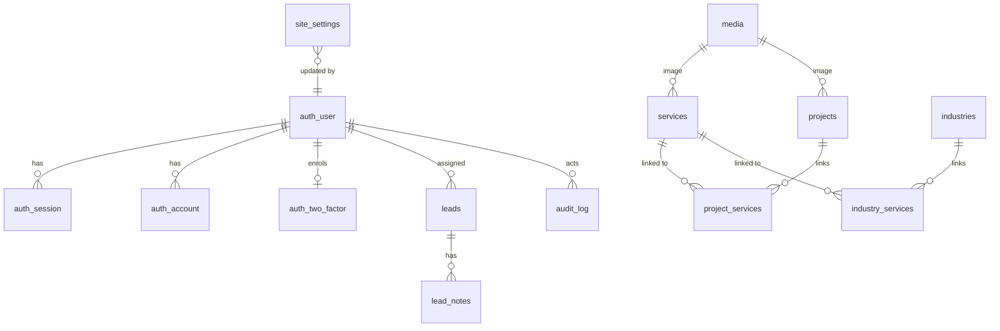

# Architecture

## Components

| Component | Technology | Responsibility |
| --- | --- | --- |
| Website (`apps/web`) | Next.js 16 App Router, React 19, Tailwind CSS | Renders public pages from cached content; accepts enquiries; serves media; exposes `/api/revalidate` and `/api/health` |
| Console (`apps/admin`) | Next.js 16, Better Auth, React Hook Form, Recharts | Authentication, RBAC, content and media management, enquiry pipeline, team, audit, system status |
| `@tekko/core` | TypeScript, Zod | Shared domain vocabulary, validation schemas used by both browser and server, permission matrix, seed content |
| `@tekko/db` | Drizzle ORM, node-postgres | Schema, SQL migrations, repositories, migrate/seed/retention scripts |
| `@tekko/platform` | AWS SDK, Azure SDK, Nodemailer, Resend | Storage drivers, mail drivers and templates, PostgreSQL rate limiter, structured logging, cache refresh client, origin verification |
| `@tekko/brand` | React SVG | Design tokens, Tailwind preset, logo, icon set, technical drawings |

## Data model

- **Content** (`services`, `projects`, `industries`) has `draft`, `published` and `archived` states. List fields (capabilities, outcomes, FAQs) are `jsonb`.
- **Site settings** are versionless JSON documents keyed by section (`company`, `home`, `about`, `legal`, `seo`, `banner`, `notifications`). Each is validated by its Zod schema on write and on read. Invalid or missing documents fall back to seed defaults.
- **Leads** keep snapshots of the service and industry names, so reports stay accurate if content is renamed or deleted.
- **Audit log** rows store actor, action, entity, a field-level diff, IP address and user agent.
- **Rate limits** (`rate_limits`, `auth_rate_limit`) hold counters shared by every replica.

## Request flows

### Page view

1. The CDN (CloudFront or Front Door) applies WAF rules and adds `x-origin-verify`.
2. The website's `proxy.ts` rejects requests without the header, except health probes.
3. The root layout calls `connection()`, so pages render per request.
4. Content reads go through `unstable_cache` with tags (`content:services` and so on) and a 120-second revalidation window.
5. `/_next/static/*` and `/media/*` are cached at the CDN edge.

### Publishing a change

1. The console server action runs `authorized(permission, …)`: session, two-factor policy and role check.
2. Input is parsed with the shared schema; the repository writes inside a transaction.
3. An audit entry is recorded with the diff.
4. `requestWebRevalidation(tags)` calls `WEB_INTERNAL_URL/api/revalidate` with a bearer secret. It uses Service Connect `http://web:3000` on AWS and `http://<web-app>` inside the Container Apps environment on Azure.
5. The receiving replica expires the tags immediately. Other replicas converge within 120 seconds.

### Previewing unpublished content

1. The console renders a link signed with `PREVIEW_SECRET` (or `REVALIDATE_SECRET`). The signature covers the page path and an expiry two hours ahead, so a link cannot be redirected elsewhere or used indefinitely.
2. `/api/preview` on the website verifies the signature, turns on Next.js draft mode and redirects to the signed path.
3. While draft mode is on, content reads bypass the tagged cache and query the database for published **and** draft entries, so nothing unpublished can enter the cache other visitors are served from.
4. Preview responses carry `noindex` metadata and an `X-Robots-Tag` header, and the CDN caches no HTML. **Exit preview** clears the cookie.

### Enquiry

1. The server action hashes the client IP, consumes the PostgreSQL rate limit, and checks the honeypot and schema.
2. The lead is inserted in a transaction and given a sequence-based reference.
3. The response returns the reference immediately.
4. `after()` sends the team notification and auto-reply, then marks the lead as notified.

## Caching and consistency

| Layer | What is cached | Invalidation |
| --- | --- | --- |
| CDN | Static assets (immutable hashes), media (immutable keys) | Never needed; keys change on upload |
| Next.js data cache | Content queries per replica | Tag expiry on publish, plus a 120-second timer |
| Browser | Static assets | Content-hashed file names |

## Failure behaviour

| Failure | Website | Console |
| --- | --- | --- |
| Database unavailable | Serves seed content; enquiries fail with a message giving the email address | Actions return a clear error; health check reports degraded |
| Email provider down | Enquiries still stored; notification not sent (visible as "Email not delivered" on the lead) | Invites show a copyable set-password link |
| Storage unavailable | `/media/*` returns 503; pages still render with drawings | Uploads fail with a retry message |
| Revalidation call fails | Content refreshes within 120 seconds | Warning toast on save |

## Portability between clouds

- Media URLs are cloud-neutral (`/media/<key>`), served by the apps from whichever storage driver is configured.
- The database is standard PostgreSQL. Migrations are plain SQL.
- Container images are identical across clouds; only environment variables differ.
- Moving from AWS to Azure means: restore a `pg_dump` into Flexible Server, copy the S3 bucket to Blob with `azcopy`, deploy the Bicep stack with the same image tag, and switch DNS.
